## What is antikj

Detects local intrusions → keylog + cam shot + screenshot → straight to Telegram.  

---

## ⚡ Features
- Monitor keystrokes & mouse (`evdev`)  
- Keylogger buffer (ignores NumLock)  
- Webcam photo (`fswebcam`) + screenshot (`scrot`)  
- Local logs → `~/security/`  
- Telegram alerts with media  
- NumLock = switch (ON = disarmed, OFF = armed)  
- 3s cooldown (anti-spam)  

---

## 🖼️ Schéma de fonctionnement

```mermaid
flowchart TD
    A[Keys / Mouse] --> B[AntikJ]
    B --> C[fswebcam 📷]
    B --> D[scrot 🖥️]
    B --> E[Log file 📝]
    B --> F[Telegram 📩]
    F --> G[You 🔒]
```



## Install 
```
sudo apt install fswebcam scrot python3-evdev python3-venv
git clone https://github.com/quanticworld/antikj
cd antikj
python3 -m venv .venv
.venv/bin/pip install -r requirements.txt
```

## Systemd

### Env file
```
TG_BOT_TOKEN=xxxx
TG_CHAT_ID=xxxx
```

### Service config

```
[Unit]
Description=AntikJ
After=network.target

[Service]
User=yourname
WorkingDirectory=/home/yourname/github/antikj
ExecStart=/home/yourname/github/antikj/.venv/bin/python antikj.py
Restart=on-failure
EnvironmentFile=/etc/antikj.env

[Install]
WantedBy=multi-user.target
```

### Run 
```
sudo systemctl daemon-reload
sudo systemctl enable --now antikj
journalctl -u antikj -f
```

## 🕹️ Usage

- NumLock OFF → armed
- NumLock ON → disarmed
- Any event → webcam + screenshot + keylog + Telegram ping
