## What is antikj

Detects local intrusions → keylog + cam shot + screenshot → straight to Telegram.  

In other words...a passive honey pot for the office keyboard ninja: let him post ‘I’ll bring croissants’, then watch him get caught red-handed 😈.


## ⚡ Features

- Monitor keystrokes & mouse (`evdev`)  
- Keylogger buffer (ignores NumLock)  
- Webcam photo (`fswebcam`) + screenshot (`scrot`)  
- Local logs → `~/security/`  
- Telegram alerts with media  
- NumLock = switch (ON = disarmed, OFF = armed)  
- 3s cooldown (anti-spam)  

---

## 🖼️ Schéma de fonctionnement

```mermaid
flowchart TD
    A[Keys / Mouse] --> B[AntikJ]
    B --> C[fswebcam 📷]
    B --> D[scrot 🖥️]
    B --> E[Log file 📝]
    B --> F[Telegram 📩]
    F --> G[You 🔒]
```



## Install 

```
sudo apt install fswebcam scrot python3-evdev python3-venv
git clone https://github.com/quanticworld/antikj
cd antikj
python3 -m venv .venv
.venv/bin/pip install -r requirements.txt
```

## Systemd

### Env file

```
TG_BOT_TOKEN=xxxx
TG_CHAT_ID=xxxx
```

## 🚀 Quick Setup

### 1. Clone & prepare environment

```bash
git clone https://github.com/quanticworld/antikj.git
cd antikj
python3 -m venv .antikj-venv
source .antikj-venv/bin/activate
pip install -r requirements.txt
```

### 2. Configure secrets

~/.config/antikj.env

Example:
```
TG_BOT_TOKEN=123456:ABC-DEF1234ghIkl-zyx57W2v1u123ew11
TG_CHAT_ID=987654321
```

### 3. Systemd user service

Put the service here: `~/.config/systemd/user/antikj.service`

Replace `USERNAME` by your user.

### 4. Enable and run the service

```
systemctl --user daemon-reload
systemctl --user enable antikj.service
systemctl --user start antikj.service
systemctl --user status antikj.service
```

### 5. Optional - Enable linger (start on boot without login)

`loginctl enable-linger USERNAME`

## 🕹️ Usage

- NumLock OFF → armed
- NumLock ON → disarmed
- Any event → webcam + screenshot + keylog + Telegram ping
